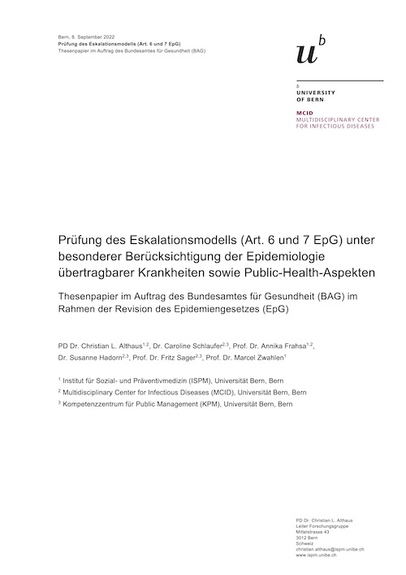

# eskalationsmodell

## Prüfung des Eskalationsmodells (Art. 6 und 7 EpG) unter besonderer Berücksichtigung der Epidemiologie übertragbarer Krankheiten sowie Public-Health-Aspekten
### Thesenpapier im Auftrag des [Bundesamtes für Gesundheit (BAG)](https://www.bag.admin.ch) im Rahmen der [Revision des Epidemiengesetzes (EpG)](https://www.bag.admin.ch/bag/de/home/strategie-und-politik/politische-auftraege-und-aktionsplaene/revision-epidemiengesetz.html)

PD Dr. Christian L. Althaus1,2, Dr. Caroline Schlaufer2,3, Prof. Dr. Annika Frahsa1,2, Dr. Susanne Hadorn2,3, Prof. Dr. Fritz Sager2,3, Prof. Dr. Marcel Zwahlen1

1 [Institut für Sozial- und Präventivmedizin (ISPM)](https://www.ispm.unibe.ch), Universität Bern, Bern  
2 [Multidisciplinary Center for Infectious Diseases (MCID)](https://www.mcid.unibe.ch), Universität Bern, Bern  
3 [Kompetenzzentrum für Public Management (KPM)](https://www.kpm.unibe.ch), Universität Bern, Bern  

### Zusammenfassung
Das aktuelle Epidemiengesetz (EpG) definiert ein dreistufiges Eskalationsmodell, welches neben der normalen Lage eine besondere und eine ausserordentliche Lage vorsieht. Ziel dieses Eskalationsmodells ist es, die Zuständigkeiten von Bund und Kantonen zu klären und zweckmässige Massnahmen zur Bekämpfung von übertragbaren Krankheiten in Abhängigkeit der epidemiologischen Lage vorzusehen. In diesem Thesenpapier unterziehen wir die Anwendung und Umsetzung des Eskalationsmodells seit der Einführung am 1. Januar 2016 einer kritischen Prüfung, mit einem spezifischen Fokus auf der COVID-19-Pandemie.

Die Analyse ergibt, dass sich das Eskalationsmodell grundsätzlich bewährt hat. Trotzdem zeigten sich während der COVID-19-Pandemie bei der epidemiologischen Lagebeurteilung sowie der Umsetzung des EpG Probleme, welche die Bekämpfung der Pandemie behinderten. Aufgrund dieser Thesen empfehlen wir folgende Weiterentwicklungen des Eskalationsmodells:

1. Es braucht **operationalisierbare epidemiologische Kriterien**, anhand welcher ein Lagewechsel von der normalen auf die besondere und von der besonderen auf die ausserordentliche Lage vorgenommen werden kann.
2. Es braucht einen festgelegten und effizienten Prozess, wie die **Lagebeurteilung** vorgenommen wird.
3. Es braucht den Einbezug einer **Expert*innengruppe**, um die Risikobewertung anhand der vordefinierten Kriterien vorzunehmen.
4. Während der besonderen Lage braucht es einen vordefinierten und effizienten Prozess der **Anhörung der Kantone**.
5. Der Bund soll in der besonderen Lage seine **Führungsrolle** wahrnehmen.
6. Es braucht ein vordefiniertes **Einsatzorgan für die Krisenbewältigung**, welches die Massnahmen während der besonderen und ausserordentlichen Lagen koordiniert.

Wir erwarten, dass eine entsprechende Anpassung des EpG die Anwendung des Eskalationsmodells erleichtert, dessen Nutzen deutlich verbessert und dadurch eine zeitgerechte Beschlussfassung und frühzeitige Bekämpfung übertragbarer Krankheiten ermöglicht.
